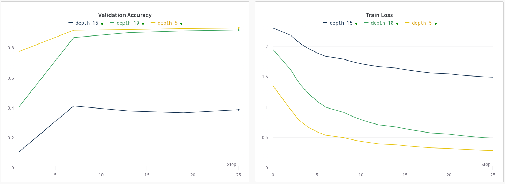

#  Laboratory 1 Convolutional neural networks with residual connections

This laboratory use relatively simple architectures to deep down on architecture with and without residual.

## Exercise 1:  A baseline MLP

Implement a *simple* Multilayer Perceptron to classify the 10 digits of MNIST.

A simple test to demostrate how using deeper architecture **can** work better.

# Convolutional nerual network with residual connection
Implement a Convolutional nerual network with residual connection to classify the class of CIFAR10.

A simple test to demostrate that deeper networks without residual connection not always work better and **even deeper** ones *with* residual connections.

# Explain the prediction of a CNN
In this exercise will use [*Class Activation Maps*](http://cnnlocalization.csail.mit.edu/#:~:text=A%20class%20activation%20map%20for,decision%20made%20by%20the%20CNN.): to view where the network focus to classify.

> B. Zhou, A. Khosla, A. Lapedriza, A. Oliva, and A. Torralba. Learning Deep Features for Discriminative Localization. CVPR'16 (arXiv:1512.04150, 2015).

- This first attempt use the parameters of the global average pool, infact the attention of the network is bit clumpsy.
 

on the left is the true class and on the right is the class predited from the class at every epoch.

- The last attempt use the parameter conditioned on the true class of the image.

