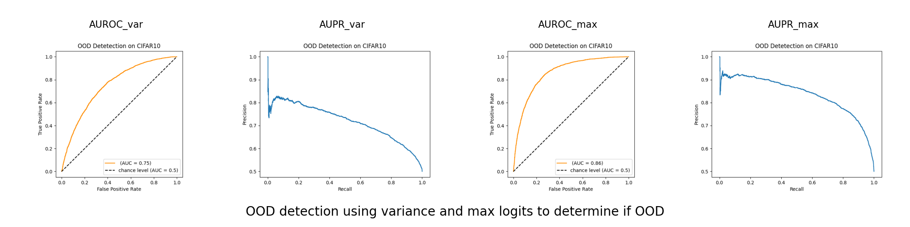
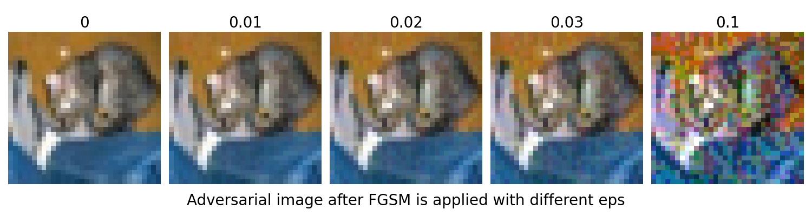

# Laboratory 4: Adversarial Learning and OOD Detection

In this laboratory we will develop a methodology for detecting OOD samples and measuring the quality of OOD detection.

This laboratory use ad network: `resnet18`

## Exercise 1: OOD Detection and Performance Evaluation
In this first exercise we will build a simple OOD detection pipeline and implement some performance metrics to evaluate its performance.

Implement an OOD detection pipeline using an ID and an OOD dataset:

+ CIFAR-10 (ID), Subset of CIFAR-100 (OOD). 

*OOD Detector* use a score representing how "out of distribution" a test sample is. We will explore two function to create this score:
- Use the max logits to detect OOD
- Use the variance to detect OOD

There are several metrics used to evaluate OOD detection performance, we will concentrate on two threshold-free approaches: the area under the Receiver Operator Characteristic (ROC) curve for ID classification, and the area under the Precision-Recall curve for *both* ID and OOD scoring. 

We will use the functions in `sklearn.metrics` to produce [ROC](https://scikit-learn.org/stable/modules/generated/sklearn.metrics.RocCurveDisplay.html) and [PR](https://scikit-learn.org/stable/modules/generated/sklearn.metrics.PrecisionRecallDisplay.html) curves for your OOD detector. 

## Exercise 2: Enhancing Robustness to Adversarial Attack

In this second exercise we will experiment with FGSM to attack a network and as a defence by trainining the network adversarialy to be (more) robust to adversarial attacks. 

Fast Gradient Sign Method (FGSM) perturbs samples in the direction of the gradient with respect to the input $\mathbf{x}$:
$$ \boldsymbol{\eta}(\mathbf{x}) = \varepsilon \mathrm{sign}(\nabla_{\mathbf{x}} \mathcal{L}(\boldsymbol{\theta}, \mathbf{x}, y)) ) $$

As we can see after eps=0.03 is not useful, a human can easily detect and also an attack detector can do it easily.  

Afterward we use FGSM to augment your training dataset with adversarial samples. This data augmentation is done, *on the fly* so that the adversarial samples are always generated using the current model.

Then we evaluate whether the model is more (or less) robust to ID samples using your OOD detection pipeline and metrics.

## Exercise 3: Target FGSM 

Implement the targeted Fast Gradient Sign Method to generate adversarial samples that *imitate* samples from a specific class. Evaluate your adversarial samples qualitatively and quantitatively.

da mostrare una figura e i due plot 